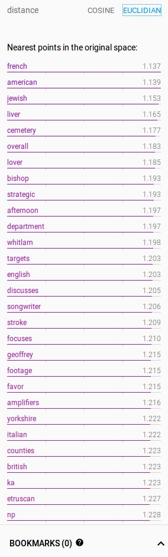
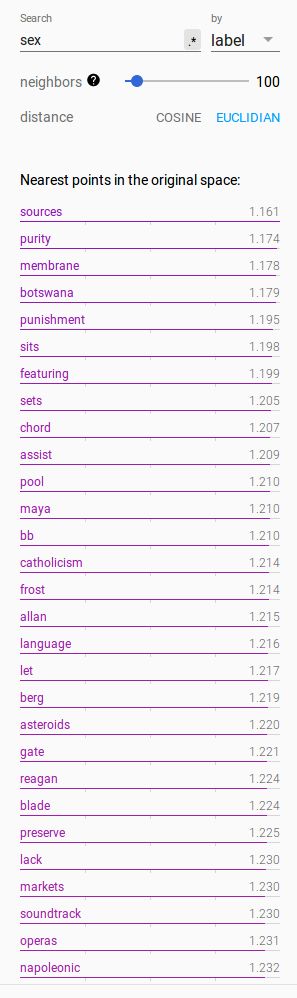
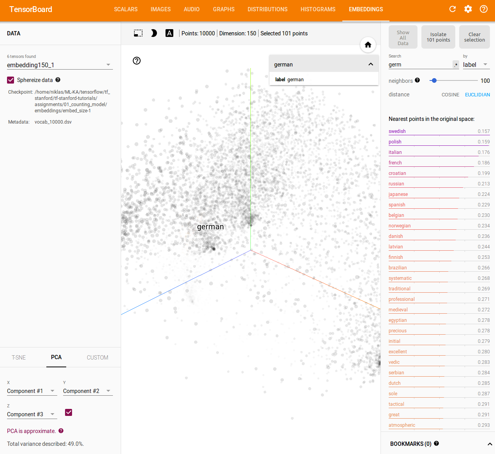
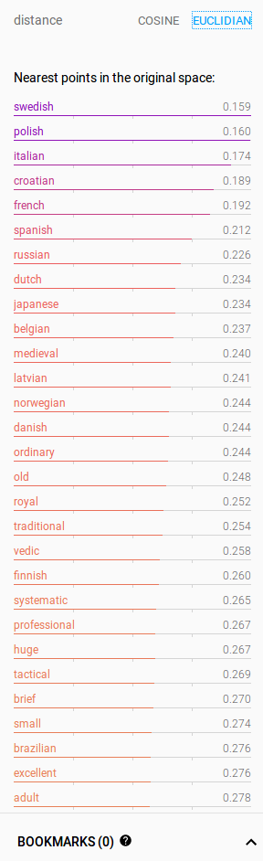
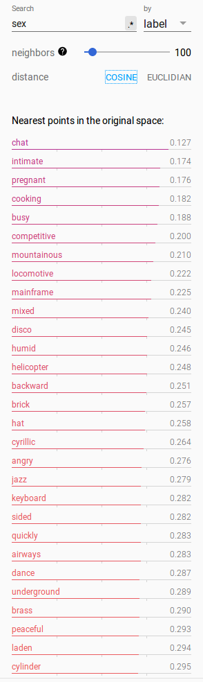

# Don't predict, count!

The paper ["Don’t count, predict! A systematic comparison of context-counting vs. context-predicting semantic vectors"](http://www.aclweb.org/anthology/P14-1023), published by a researchers at the university of Trento, provides a comparison of *context-counting models* the and the *context predicting models*.

## Context-predicting models

In this case, a neural network learns an representation of the input words while it is trained to give a probability distribution over the following word candidates. So basically, for a given input word, the neural network infers the trailing possible words.

Providing a complete probability distribution over the complete dictionary (which can have thousands of words) is an expensive task because the normalization factor needs to be calculated. Instead of using the softmax approach with an cross-entropy loss function, one can use the *negative sampling*. This loss is provided by tensorflow via the `nce_loss` function. The [Tensorflow tutorials](https://www.tensorflow.org/tutorials/word2vec#scaling_up_with_noise-contrastive_training) provide a nice intro to this method, which is computationally much more cheap.

So we are not interested in the inference capabilities of our model, but in the transformed representations of the vocabulary (we would need a softmax for "real" inference). The aim is to retrieve a `Vocabulary Size x Embed Size` matrix which assigns a vector of length `embed size` to every word of the vocabulary. This are the weights of the neural network. 

### Contructing Training Data via Skip-Gram

Training data is generated with the *Skip-Gram* approach. The following example is taken from the aforementioned Tensorflow tutorial (with slight variable renaming):

We are interested in the contextual words per word in the sentence `the quick brown fox jumped over the lazy dog`. We produce `(target, center)` tuples to show the relationships of the words of this sentence:

```
([the, brown], quick), ([quick, fox], brown), ([brown, jumped], fox), ...
```
The training data is produced using the the words to the left and the right as target and the word itself as the center. One could easily expand this window to the left and right to more words and even an asymmetric window.
>  Recall that skip-gram inverts contexts and targets, and tries to predict each context word from its target word, so the task becomes to predict 'the' and 'brown' from 'quick', 'quick' and 'fox' from 'brown', etc. Therefore our dataset becomes `(quick, the), (quick, brown), (brown, quick), (brown, fox), ...` of `(input, output)` pairs.

(quoted from the TF tutorial)

### Minimizing the NCE-Loss with a Neural Network

Lets have a look at the `loss` that needs to be minimized: 

```
loss = tf.reduce_mean(tf.nn.nce_loss(weights=nce_weight,
                                             biases=nce_bias,
                                             labels=target_words,
                                             inputs=embed,
                                             num_sampled=NUM_SAMPLED,
                                             num_classes=VOCAB_SIZE))
```

- `nce_weight` is the `VOCAB_SIZE x EMBED_SIZE` embedding matrix
- `nce_bias` is the `VOCAB_SIZE x 1` bias vector
- `target_words` is the `BATCH_SIZE x 1` vector of the indices of the target words (that shall be predicted from the center word)
- `embed` is the `EMBED_SIZE x 1` embedding vector of the center word (which was retrieved by a lookup-method given the index of the center word)
- `NUM_SAMPLED` is the number of negatives that shall be sampled from the vocabulary and that are going to be discriminated by the target function
- `VOCAB_SIZE`: the vocabulary size. This parameter might be needed if the function does not infer the vocabulary size from the first dimension of `nce_weight`. This might be useful if one provides an embedding matrix whose first dimension is larger than `VOCAB_SIZE`. One could provide more information to the embedding, but right now I cannot think of an useful example

The loss function that needs to be maximized does the following:

- It knows the center words (given by `inputs`)
- It knows the indices (which can be trivially translated into an one-hot-encoding) of the (one or more) target words from `labels`
- It samples `NUM_SAMPLED` integers from `range(0, VOCAB_SIZE)` which serve as the indices for the lookup of the embedding matrix
- It looks up the embedding vectors of the labels / target words from the `nce_weight` matrix with the sampled indices (*positives*)
- It looks up the embedding vectors with the sampeld indices (*negatives*)
- The loss function consists of a logistic regression which takes the embeddings as inputs and maximizes the probabilites such that the *binary targets*
    - P(is target word ; under the condition that embeddings of the center words and the target words (positives)) is maximized and
    - P(is not a target word  ; under the condition that embeddings of the center words and the target words (negatives)) is maximized)
    - ergo, the **sum of the both components is maximized**
- I do not know it yet, but I think only the single embedding vector of the center word / input = `embed` is maximized. This might be a convex problem and could be easy to solve (I don't know it yet)
- It could also be possible that to maximize the function regarding the embeddings of the `positives` and `negatives`, because their influence on the loss function is orthogonal. right now when I think about it, this seems more reasonable to me because that produces more updates to the vectors and could yield to faster convergence.

To train the model, try different `BATCH_SIZE` (the smaller the faster the convergence, but it could be stuck in the next local minimum), different learning rates and different optimizers besides the "classic" `GradienDescentOptimizer`.

Training tool a reasonable amount of time on my laptop, about less than 3 minutes.

### Neural Network Embedding Examples

Tensorflow PCA:
> For fast results, the data was sampled to 50 000 points randomly projected down to 200 dimensions.

The **embedding size is 128**.

Approximate PCA. The visualization in the first three principal components seems to have no dedicated structure, looks quite like noise. **Only about 3% of the variance are explained in the first 3 principal components.** This is not much and indicates that the words do not lie on a linear manifold in the high-dimensional space. The manifold might be non-linear.


The position of **dog** and its lexicographically neighbors indicates that there is no lexicographical similarity considered in the embeddings (which would be quite surprising, because this was not part of the learning task).


Results and nearest neighbors for **black**. It is hard to say if the closest words in this area are really related. I'm wondering about the results and am not very satisfied.


The results for **german** look more promising. One could expect these words in the neighborhood. 


The neighborhood of **german** in euclidean distance. The ordering of the neighboring words did not change. Maybe this holds in a general case.  The profit of using cosine distance but euclidean is the fact that it is in the range of [0,1] and can be interpreted better in high-dimensional spaces.



This is the result for **sex**.



### Future Development

Some thoughts about future tasks:

- Use a **larger window size** (up to the mean sentence length e.g.). This will certainly increase computation time. One could need more "negative targets" then
- Sample **more negatives** to discriminate against in the NCE-loss-function. But this could counteract the effort: If very many words are sampled, a closely related word to the center word could mistakenly be discriminated which would yield to worse results. Setting the parameter `remove_accidental_hits` in the `nce_loss` could be necessary to avoid that "positive targets" are used as "negatives"
- Experiment with **embedding sizes**
- Use other optimizers
- Use deeper networks (what would be the effect? Is there a theoretical foundation for that?)
- Use more information for the input, i.e. the first dimension of the `nce_weight` could exceed `VOCAB_SIZE`

## Context Counting Models

Before the use of Neural Networks for word embeddings, context counting models were used. They can use the aforementioned Skip-Gram approach to model relationships between words, but there are also other approaches available like the *CBOW* (Continuous Bag-of-Words) model. The only difference in Skip-Gram vcs CBOW is that whilst Skip-Gram predicts the *context from the center word*, CBOW predicts the *center word from the context word*.

The embedding matrix (based on word counts rather than predictions) is constructed *without a Neural Network approach* as follows:

- Construct your vocabulary of size `VOCAB_SIZE` (e.g. by taking the `VOCAB_SIZE` most frequent words) and encode your words in indices
- Label all other (i.e. less frequent and thus regarded as less important) words with a dummy, e.g. `UNK` for "unknown"
- Construct (center, target) tuples with the Skip-Gram approach
- Fill an `VOCAB_SIZE x VOCAB_SIZE` matrix with the ço-occurences of two words. Therefore, this matrix is also named **co-occurence matrix**
- When the cooccurence matrix is constructed, normalize the rows which results in a probability distribution of the center words about the target words
- Use **Singular Value Decomposition** to reduce the dimensionality of this matrix to a specified dimension. This results in an embedding matrix with the size `VOCAB_SIZE x EMBEDDING_SIZE`
- **The SVD can be very expensive!** I don't know if one can exploit GPU capabilities for this task or if this can even be parallelized

### Dim-reduced Cooccurence-Matrix Embedding Examples

Tensorflow PCA:
> For fast results, the data was sampled to 50 000 points randomly projected down to 200 dimensions.

Once the cooccurence matrix is calculated, one can apply several SVDs to get multiple embeddings. I tried the following embedding sizes: **50, 100, 150, 200, 250, 300**. Sadly, I missed to construct the embedding size 128 to have the same conditions as in the NN approach. But approximating and interpolating with 100 and 150 should also be ok.

Approximate PCA. The visualization in the first three principal components seems to have no dedicated structure, looks quite like noise. **Very different to the NN approach: About 50 of the variance are explained in the first 3 principal components.** This is very much and indicates that the words lie on a linear manifold in the high-dimensional space. This might not be a surprise, because no non-linearities were involved in the generation of the embedding matrix (*does SVD add nonlinearities? I don't think so.*).


The position of **dog** and its lexicographically neighbors indicates that there is no lexicographical similarity considered in the embeddings (which would be quite surprising, because this was not part of the learning task). This observation is valid with the NN approach.


Results and nearest neighbors for **black**. **This seems to be more reasonable than the embedding in the NN approach.** The
 nearest neighbor is **red**, which was not listed in the NN case. 


Comparison of the word **black** in the **100 and 300 embedding** (for 100, see also the above picture). The ordering does not change, but the cosine distance does. Unsurprisingly, this distance is dependent on the number of dimensions.


The results for **german** are similar to those in the NN approach. But in this case, "swedish" is closer to german than "french". I am curious what our politicians would say about this ;-).

Interestingly, **the ordering of the neighbors change if we shift the embedding from 100 to 150 dimensions.**




As in the NN case, the ordering does not change if the distance is switched from cosine to euclidean ("german" in 100 dimensions).



Last but not least, the results for **sex** differ very much from the NN approach.




### Future Development

Some thoughts about future tasks for the context-counting model:

- Use a **larger window size** (up to the mean sentence length e.g.). This will certainly increase computation time. But the effect on the SVD calculation should be minimal, because the rows are normalized.
- Use **softmax** for normalization instead of the simple normalization
- Implement embedding size 128
