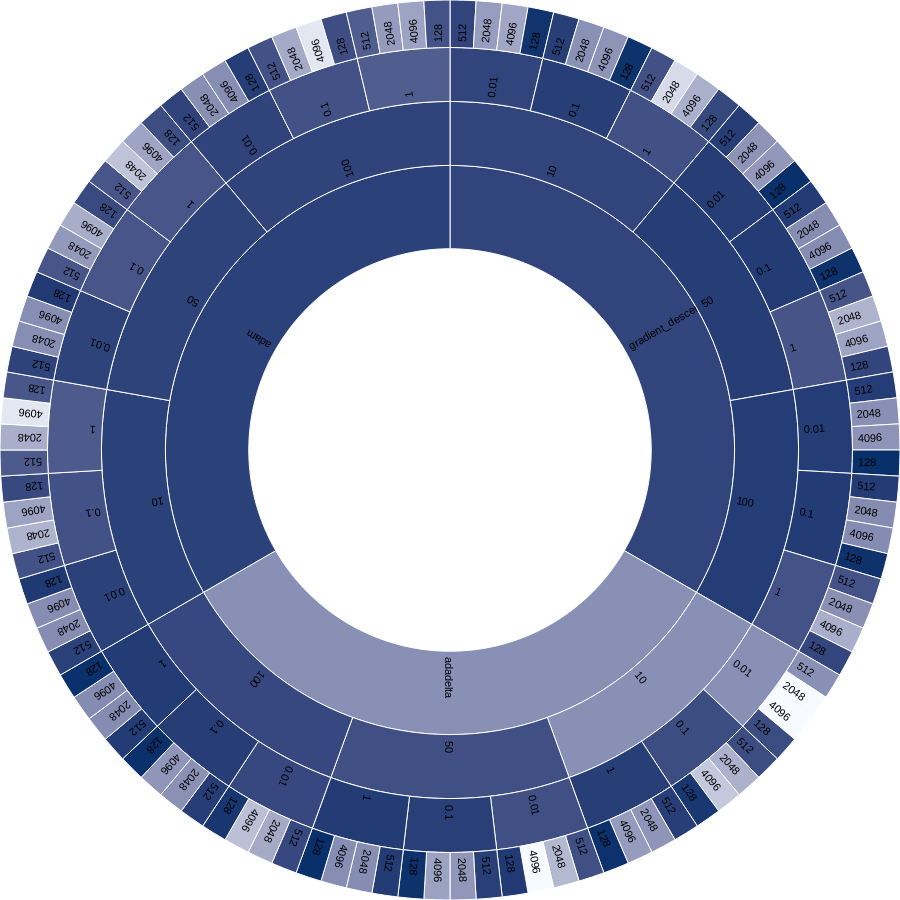

# Logistische Regression mit notMNIST

## Das Trainingsskript
Das MNIST-Beispiel wurde lediglich auf die notMNIST Daten (sehr unterschiedliche Bilder mit 10 Labels, den Buchstaben A-J) angepasst. Die Daten können auch mit dem MNIST-Loader geladen werden (es sind auch 28x28px Grauwertbilder). [Hier](./logistic_regression_not_mnist.py) ist das Skript zu finden.

## Die Metaanalyse

Das Logistiche Regressionsmodell wird durch folgende, in `config.json` gespeicherte Werte parametrisiert:

- Lernrate
- Anzahl Epochen
- Batchgröße
- Trainingsalgorithmus

Eine Kodierung der Optimierer ohne Boolean, also ein key "Optimizer" mit einem String als value, wäre besser gewesen.

Es wurde eine Grid-Suche durchgeführt, indem Modelle mit verschiedene Kombinationen dieser Parameter trainiert wurden. Das Skript [meta-study](./meta_study.py) erstellt diese Parameterkombinationen und ruft das Trainingsskript in Subprozessen auf (pro Durchgang wird eine json-config erstellt, welche dann vom Trainigsskript eingelesen wird). 

Nach Abschluss der TensorFlow-Session werden folgende Variablen exportiert:

- Anzahl Training Samples
- Anzahl Test Samples
- Accuracy
- Laufzeit

Damit alle Resultate aller Parameterkombinationen in einer Datei gespeichert werden können, wird ein Array von JSONs erstellt. Dafür is es nötig, bei jedem Durchlauf die Datei `results.json` als Dictionary einzulesen, die Ergebnisse des aktuellen Modells in das Dictionary zu schreiben und dieses wiederum in die Datei zurückzuschreiben. Eine "on-the-fly" Manipulation on-disk ist nach meiner Kenntnis nicht möglich.

Mit `json_to_csv.py` kann `results.json` in ein [CSV](./results.csv) umgewandelt werden, welches zur weiteren Analyse / Visualisierung genutzt werden kann. In [`results_agg.csv`](results_agg.csv) wurden die Spalten der Optimierer zusammengeführt. **Das Ziel ist, ein Gefühl dafür zu bekommen, welche Parameterkombination welchen Einfluss auf die Accuracy hat.**

Es gab 2 herausstechende Ausreißer, die rund 20% unter der nächstbesten Accuracy lagen: 

**Die Ausreißer:**

| learning_rate | n_epochs | accuracy | batch_size | test_samples | optimizer | train_samples | time         |
|---------------|----------|----------|------------|--------------|-----------|---------------|--------------|
| 0.01          | 10       | 0.308    | 2048       | 10000        | adadelta  | 55000         | 1.5731105804 |
| 0.01          | 10       | 0.146    | 4096       | 10000        | adadelta  | 55000         | 1.3878922462 |

**Die nächst bessere Lösung:**

| learning_rate | n_epochs | accuracy | batch_size | test_samples | optimizer | train_samples | time         |
|---------------|----------|----------|------------|--------------|-----------|---------------|--------------|
| 0.01          | 50       | 0.5667   | 4096       | 10000        | adadelta  | 55000         | 5.8967356682 |

**Die Besten:**

| learning_rate | n_epochs | accuracy | batch_size | test_samples | optimizer        | train_samples | time          |
|---------------|----------|----------|------------|--------------|------------------|---------------|---------------|
| 0.01          | 100      | 0.8956   | 128        | 10000        | gradient_descent | 55000         | 42.9409191608 |
| 0.01          | 50       | 0.8953   | 128        | 10000        | gradient_descent | 55000         | 22.1951329708 |
| 1             | 50       | 0.8948   | 128        | 10000        | adadelta         | 55000         | 24.1792676449 |
| 1             | 100      | 0.8944   | 128        | 10000        | adadelta         | 55000         | 44.8267977238 |

Mit dem Tool [RAWGraphs](http://app.rawgraphs.io/) wurde das CSV eingelesen und folgende Visualisierung erstellt (die Accuracy der genannte Ausweißer wurden auf die nächstbesten `.5667` gesetzt, da sonst die lineare Farbskala unnötig nach unten erweitert wird). Je dunkler die Farbe, desto besser die Accuracy.

## Interpretation

Die Helligkeit / die Accuracy des hierarchischen Plots wird über jede Hierarchiestufe gemittelt. Somit lässt die Grafik folgende Schlüsse zu:

- `adadelta` ergibt im Mittel die geringste Accuracy (innerer Kreis)
- Je kleiner die Batchsize, desto besser die Accuracy (äußerer Kreis)
- Die Abhängigkeit der Accuracy von der Lernrate ist verschieden (betrachte dazu den 2. Kreis von außen):
    - `adam` und `gradient-descent`: eine Lernrate von `0.01` zeigte meist die besten Ergebnisse aller Lernraten, `1` war klar die schlechteste
    - bei `adadelta` war es genau umgekehrt
- Zweiter Kreis von innen: Je mehr Epochen, desto besser die Accuracy. Der Einfluss der Epochenanzahl war bei `adadelta` deutlich größer.

## Fazit

Man kann festhalten, dass es erhebliche Unterschiede zwischen den Optimierungsverfahren `gradient-descent`, `adam` und `adadelta` gibt. In den Lecture Notes des Stanford-Kurses wird lediglich gesagt, das man `adam` verwenden sollte. [Sebastian Ruder](http://sebastianruder.com/optimizing-gradient-descent/) hat die Algorithmen in seinem Blogpost beschrieben. 

Man könnte sich überlegen, ein Modell aus diesen Erkenntnissen zu erstellen, welches die Funktion der Accuracy in Abhängigkeit der Eingabeparameter aufzeichnet. Ein Entscheidungsbaum würde sich dafür z.B. anbieten.

**Es ist fraglich, ob die bei dieser logistischen Regression erzielten Schlüsse auf größere Probleme, wie z.B. das Training komplexer neuronaler Netze, übertragbar sind. Eine solche Metaanalyse würde bei komplexeren Problemen ohne ausreichende Hardwareausstattung wahrscheinlich viel zu lange dauern.**

