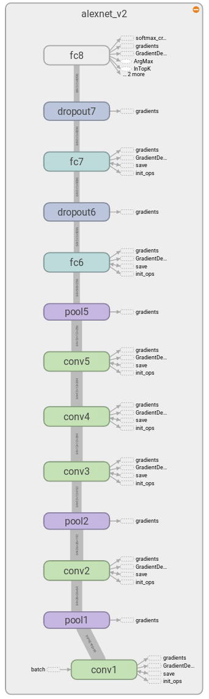

# Discussion of AlexNet (2012)

This collection headed us towards AlexNet in the first place: [Overview by Adit Deshpande on CNNs](https://adeshpande3.github.io/adeshpande3.github.io/The-9-Deep-Learning-Papers-You-Need-To-Know-About.html)

Link to the AlexNet paper: [Krizhevsky, Alex, Ilya Sutskever, and Geoffrey E. Hinton. "Imagenet classification with deep convolutional neural networks." Advances in neural information processing systems. 2012.](https://papers.nips.cc/paper/4824-imagenet-classification-with-deep-convolutional-neural-networks)

AlexNet was submitted to the [LSVRC-2010 challenge](http://image-net.org/challenges/LSVRC/2010/). Some key aspects of the network architecture:

- **ReLUs** are used as activation functions. As the authors say, this speeds up training significantly
- 2 dropout layers are used ([About Dropout](https://www.cs.toronto.edu/~hinton/absps/JMLRdropout.pdf)): Dropout is a regularization technique that can be seen as training multiple architectures in parallel / building an ensemble model with "one model". They state in the paper that *"Without dropout, our network exhibits substantial overfitting. Dropout roughly doubles the number of iterations required to converge."*
- Data augmentation / preprocessing was used as a regularization technique as well

## Approaching more relevant problems: From MNIST to CIFAR10/100 to ImageNet

Here you can find a [list of deep learning datasets](http://deeplearning.net/datasets/).

The [MNIST Dataset](http://yann.lecun.com/exdb/mnist/) with images of the handwritten numbers 0-9 in greyscale images with 60k training samples and 10k test samples can be seen as the baseline in classification tasks for image recognition in machine learning

The [CIFAR-10 and CIFAR-100 datasets](https://www.cs.toronto.edu/~kriz/cifar.html) consist of small coloured images.

- CIFAR-10: 60000 32x32 colour images in 10 classes, with 6000 images per class
- CIFAR-100: 100 classes containing 600 images each.

[The ImageNet Dataset](http://www.image-net.org/) provides about 14 million images. It is said on the homepage:

 > ImageNet is an image database organized according to the WordNet hierarchy (currently only the nouns), in which each node of the hierarchy is depicted by hundreds and thousands of images. Currently we have an average of over five hundred images per nod

Often, only subsets of ImageNet are used for training, as in the LSVRC-2010 challenge, where AlexNet was trained on.
It contained only 1,2 million images from 1000 classes.

## Prerequisites

- **Python 2.7**, otherwise you'll run into problems
- **TensorFlow r1.1**: before this release, the pre-implemented nets were not included in the TF-Slim-package
- Clone the tensorflow-models repo

For your information: my specs are

- CPU: Intel i7-6700HQ Quadcore
- GPU: NVIDIA GeForce GTX 970M with 6 GB VRAM and 1280 CUDA-cores

## AlexNet with the Flowers Dataset

We are refering to the tensorflow-slim (tf.sorflow.contrib.slim) implementation of AlexNet. Authors of tf-slim are Sergio Guadarrama and Nathan Silberman.

We are going to see how the following tasks are solved:

- Implementation of AlexNet with a higher-level API
- Download the dataset
- Transform the dataset to a TF-specific format
- Preprocess the input images
- Train AlexNet on this data

### About TF-Slim and tensorflow-models

TF-Slim reduces boilerplate code and yields faster productive implementations by providing a higher-level API to define,  import and train complex models.
Despite that, it preserves the capability to augment the models (or the pipeline around the models) to fit individual needs (e.g. custom summaries, loss functions, data handlers).
These resources give an overview about TF-Slim:

- [The TF-Slim Homepage](https://github.com/tensorflow/tensorflow/tree/master/tensorflow/contrib/slim)
- [A list of models already implemented in TF-Slim](https://github.com/tensorflow/tensorflow/tree/master/tensorflow/contrib/slim/python/slim/nets)

Moreover, we are going to rely on the slim-directory from the [tensorflow-models repo providing a list of already implemented (and quite up-to-date) models, varying in code and documentation quality](https://github.com/tensorflow/models). This repo provides classes for handling specific datasets (MNIST, CIFAR-X, Flowers) which facilitiates downloading, data handling and preprocessing:

- [the tensorflow-models slim directory](https://github.com/tensorflow/models/tree/master/slim)
- [The tf-models-slim package with dataset handlers](https://github.com/tensorflow/models/tree/master/slim/datasets)
- [The tf-models-slim package with preprocessing functions](https://github.com/tensorflow/models/tree/master/slim/preprocessing)

### The AlexNet Implementation

[The tf-slim AlexNet implementation](https://github.com/tensorflow/tensorflow/blob/master/tensorflow/contrib/slim/python/slim/nets/alexnet.py) is done according to the [AlexNet V2: One weird trick paper](https://arxiv.org/abs/1404.5997). This incorporates some changes compared to the original publication from 2012.

This is how the architecture is presented in Tensorboard (the "graph" tab):



As we can see, AlexNet consists of

- 5 convolutional layers
- 3 pooling layers (that are enumerated to match the conv layers they belong to)
- 3 fully connected layers and
- 2 dropout layers.

Please do also take attention to the fact that [fully-connected (aka "dense") layers are implemented as conv2d layers with kernel size 1x1](https://github.com/tensorflow/tensorflow/blob/master/tensorflow/contrib/slim/python/slim/nets/alexnet.py#L111). This has been described by [Yann LeCun: In ConvNets, there is no such thing as "fully-connected layers"](https://www.facebook.com/yann.lecun/posts/10152820758292143).

A research group from Freiburg has even published a paper where they [treat pooling layers as convolutional layers: The All Convolutional Net](https://arxiv.org/pdf/1412.6806.pdf). Here is a link to a question on Quora why [fully convolutional networks are favorable over "normal" CNNs](https://www.quora.com/What-are-the-advantages-of-Fully-Convolutional-Networks-over-CNNs).

### Handling the Flowers Dataset

It is not possible to train AlexNet on the data from the LSVRC challenge in a reasonable amount of time on your local machine. Therefore, we are going to train AlexNet on [the Flowers dataset](https://github.com/tensorflow/models/tree/master/slim#preparing-the-datasets), which seems to be an unique dataset solely used by tf-slim. The dataset consists of roughly 5000 images from Flickr in the 5 categories

```
0:daisy
1:dandelion
2:roses
3:sunflowers
4:tulips
```

The data is prepared by the methods from [`flowers.py`]() according to the pipeline:

1. [`download_and_convert_flowers.py`](https://github.com/tensorflow/models/blob/master/slim/datasets/download_and_convert_flowers.py) does the following with the help of [`datasets_utils.py`](https://github.com/tensorflow/models/blob/master/slim/datasets/dataset_utils.py):
    - Download the data from the specified URL
    - Decompress the `tar.gz` file
    - Convert the data to TFRecord file format
2. Use the [`flowers.py` module](https://github.com/tensorflow/models/blob/master/slim/datasets/flowers.py) to create a [TF-Slim dataset](https://github.com/tensorflow/tensorflow/blob/master/tensorflow/contrib/slim/python/slim/data/dataset.py). The function of these dataset can be infered from the constructor parameter names:
    ```python
    return slim.dataset.Dataset(
        data_sources=file_pattern,
        reader=reader,
        decoder=decoder,
        num_samples=SPLITS_TO_SIZES[split_name],
        items_to_descriptions=_ITEMS_TO_DESCRIPTIONS,
        num_classes=_NUM_CLASSES,
        labels_to_names=labels_to_names)
    ```
3. Hand the Slim-Dataset over to a [TF-Slim DatasetDataProvider](https://github.com/tensorflow/tensorflow/blob/master/tensorflow/contrib/slim/python/slim/data/dataset_data_provider.py). Have a look in the source code to see that this class provides parameters for the number of parallel readers to use, a shuffle parameter with it's seed and the number of epochs.

Good data handling is crucial for time efficiency. The `queues` are not related to the batch size, they indicate how many entities (image / label combinations) are waiting to be read as a batch by the net.
The images need to be transferred to the GPU VRAM, and the queues seem to prepare this "transfer" via the CPU during the inference / update cylce of the net with the aim to not to loose time. But I might be mistaken. This queue is then used by [tf.train.batch](https://www.tensorflow.org/api_docs/python/tf/train/batch) to load batches out of the queue. The following provides more information about [Data Input for TensorFlow: Placeholders, Protobufs and Queues](https://indico.io/blog/tensorflow-data-inputs-part1-placeholders-protobufs-queues/). **It seems that there is a difference between using the queues and the plain old feed_dicts.** I am pretty sure that there are also differences in terms of speed / efficiency.

### Image Preprocessing

For preprocessing the [inception preprocessing module](https://github.com/tensorflow/models/blob/master/slim/preprocessing/inception_preprocessing.py#L278) from the `tensorflow/models/slim` repo is used.
Preprocessing is done differently depending on whether it is used for training or evaluation (there are 2 separate methods for in this module).
**Take a look into the source code to see what the inception preprocessing really does.**
I simply used it without further investigation.

### Building the Computational Graph and run a Session

All the following operations can be traced in the Tensorboard graph tab:


As you can see, there are **auxiliary nodes** to the left. They are accessed by several nodes in the graph and are indicated inside the main graph as very small nodes with dashed boundaries.

The Computational Graph is build with the following components:

- Define the Data Input process with the queues (node `parallel_read`)
- Get the training dataset from the whole dataset
- Load batches from the specified training dataset
- preprocess the image from the batch, e.g. by node `distort_image` (which dumps the image to the auxiliary node `batch`)
- Pass the batch through the net (node `alexnet_v2`)
- Compute the loss function (cross entropy, which is used to do a softmax)
- define an optimizer (node `GradientDescentOptimizer`)
- compute `accuracy` and `recall@2` alongside to the loss, but they are not used for optimization

With [The slim.learning module](https://github.com/tensorflow/tensorflow/blob/master/tensorflow/contrib/slim/python/slim/learning.py), some more operations are added by one single command with it's parameters [`slim.learning.train`](https://github.com/tensorflow/tensorflow/blob/master/tensorflow/contrib/slim/python/slim/learning.py#L532):

- Where to write summaries
- When to write summaries
- How to init

### Observations

Parameters for learning from the paper:

- Dropout probability: 0.5
- Batch size 128
- custom weight update rule with momentum of 0.9 and weight decay of 0.0005

#### Convergence with Plain Gradient Descent

After **700 epochs** with

- learning rate 0.01
- GradientDescentOptimizer
- Batchsize 56

the statistics in Tensorboard look like this:

- Scalar summaries of loss, accuracy and recall@2 on the **training set**, not the validation set:


With further training, **it might be possible to train the network until overfitting** (100% accuracy)

- One can see that **the distribution tab in Tensorboard is way more informative than the histogram tab**

- The histogram tab


- The distribution tab


A quick glance at some raw and preprocessed images:


#### No Convergenve with the Adam Optimizer

Default parametrization with the **AdamOptimizer** yields not to convergence.
As one can see in the distribution tab from tensorboard, **in some layers, all weights are set to 0** (fc6 and pool2).
These distributions look completely different to those that result from plain gradient descent training.


## Lessons Learned

- [Why use **xrange**](http://pythoncentral.io/how-to-use-pythons-xrange-and-range/)

    > What does that mean? Good question! It means that xrange doesn't actually generate a static list at run-time like range does. It creates the values as you need them with a special technique called yielding. This technique is used with a type of object known as generators.

- The evaluation metrics like *accuracy* and *recall@X* are not needed for optimization - the optimization criterion is the loss and optimization is defined by the `slim.learning.create_train_op(total_loss, optimizer)` command. To calculate them, use [the slim metrics module](https://github.com/tensorflow/tensorflow/blob/master/tensorflow/contrib/slim/python/slim/evaluation.py).
- Alongside the Slim training operation. [Update operations can be defined](https://github.com/tensorflow/tensorflow/blob/master/tensorflow/contrib/slim/python/slim/learning.py#L394)
- I was suspicious about the non decreasing loss in Adam after many epochs. A NN practicioner said to me, that **one should see an effect on the loss at least after 10-20 epochs**
- There is a difference between summaries and checkpoints! With Slim, both are stored in the same directory. It might be benefitial to divide summaries and checkpoints to different directories so they can be versioned better

## ToDo

- Export one image per batch with Softmax values
- Export one image per batch with feature map in the first layer (visualize the learned kernels like edge detection, corner detection)
- Create image embedding for the Tensorboard embedding tab: subset for the raw matrices for the images and see which feature maps are close to each other on intermediate layers
- Use the validation set to report the accuracy
- Distinguish between train, validation and test set


## I Don't yet Understand

- What is the `fraction_of_128_full` in `Tensorboard/scalars/batch` for? And why is it 128 instead of 64? It might have something to do with the argument `capacity` in [tf.train.batch](https://www.tensorflow.org/api_docs/python/tf/train/batch). Are there 2 queues waiting to feed the network?
- How to specify the time of checkpoint creation
- Why are there so few movements in the histograms with Adam
- Preprocessing: What is done to the images with the inception preprocessing?
- Why does Tensorboard always overwrite the images in the images tab? It would be nice if the images were kept batch-wise. Maybe one needs to specify the namespaces in the image tab in Tensorboard, so that a new namespace is created for every batch.
